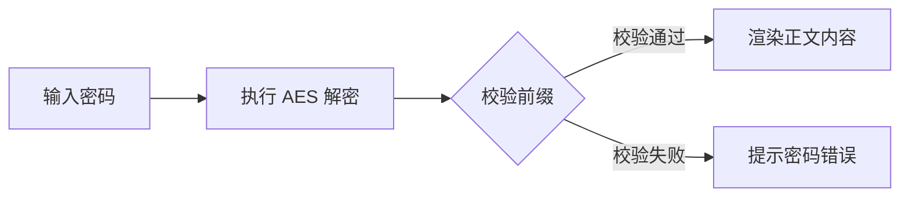

这是一篇用于测试文章加密功能的示例内容。  
当 `encrypted: true` 时，页面会在前端要求输入密码后再尝试解密正文。

## 前言字段示例

```yaml
---
title: 加密文章示例
published: 2024-01-15
description: 用于演示页面加密与密码验证流程
encrypted: true
password: "123456"
alias: "encrypted-example"
tags: ["示例", "加密"]
category: "技术"
---
```

## 常用字段说明

| 字段 | 说明 |
|---|---|
| `title` | 文章标题 |
| `published` | 发布日期 |
| `description` | 文章摘要 |
| `encrypted` | 是否启用加密 |
| `password` | 访问密码 |
| `alias` | 自定义访问路径 |
| `tags` | 标签列表 |
| `category` | 文章分类 |
| `draft` | 是否草稿 |

## 自定义别名

设置 `alias` 后，文章可通过 `/posts/{alias}/` 访问。  
建议使用小写字母和连字符，避免空格与特殊字符。

## 解密流程示意



如果你看到这段内容，说明当前示例文件已成功通过解密渲染。
