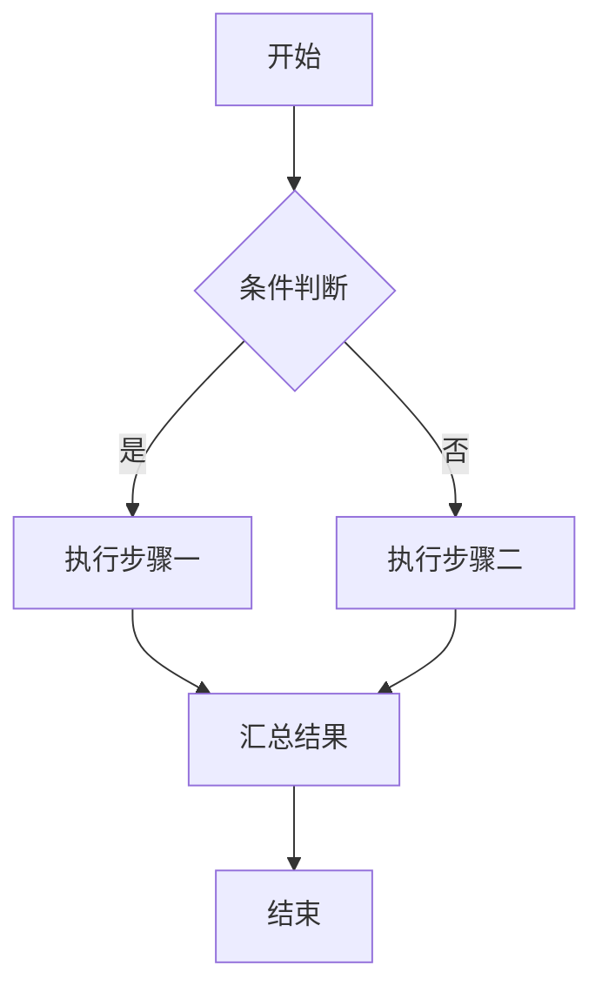
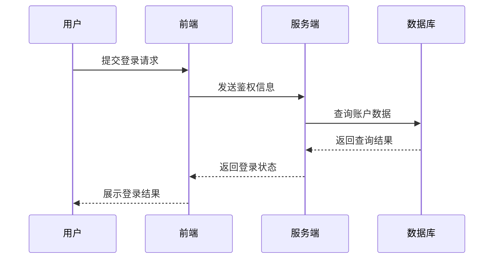
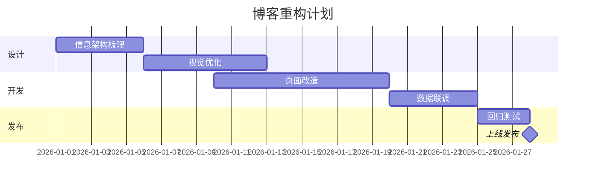
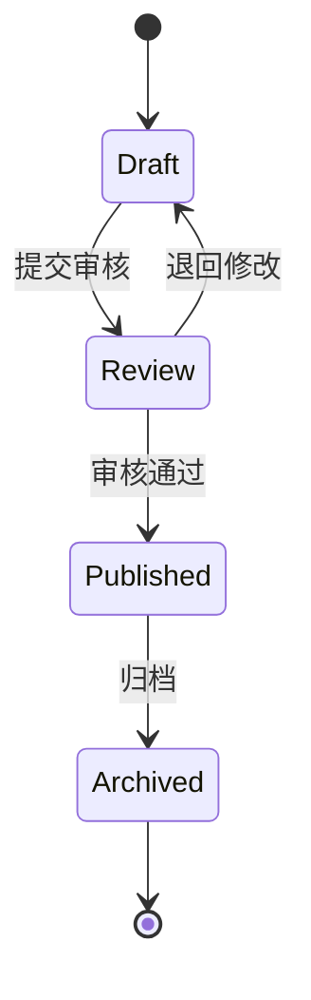

# Mermaid 图表快速示例

本文演示如何在 Markdown 中使用 Mermaid 绘制流程图、时序图、甘特图和状态图。

## 流程图

```mermaid
graph TD
    A[开始] --> B{条件判断}
    B -->|是| C[执行步骤一]
    B -->|否| D[执行步骤二]
    C --> E[汇总结果]
    D --> E
    E --> F[结束]
```

## 时序图

```mermaid
sequenceDiagram
    participant 用户
    participant 前端
    participant 服务端
    participant 数据库

    用户->>前端: 提交登录请求
    前端->>服务端: 发送鉴权信息
    服务端->>数据库: 查询账户数据
    数据库-->>服务端: 返回查询结果
    服务端-->>前端: 返回登录状态
    前端-->>用户: 展示登录结果
```

## 甘特图

```mermaid
gantt
    title 博客重构计划
    dateFormat  YYYY-MM-DD
    section 设计
    信息架构梳理 :a1, 2026-01-01, 5d
    视觉优化     :a2, after a1, 7d
    section 开发
    页面改造     :b1, 2026-01-10, 10d
    数据联调     :b2, after b1, 5d
    section 发布
    回归测试     :c1, after b2, 3d
    上线发布     :milestone, after c1, 0d
```

## 状态图

```mermaid
stateDiagram-v2
    [*] --> Draft
    Draft --> Review : 提交审核
    Review --> Draft : 退回修改
    Review --> Published : 审核通过
    Published --> Archived : 归档
    Archived --> [*]
```

Mermaid 能让技术文档与博客内容更直观，推荐在流程说明和系统设计文档中使用。
