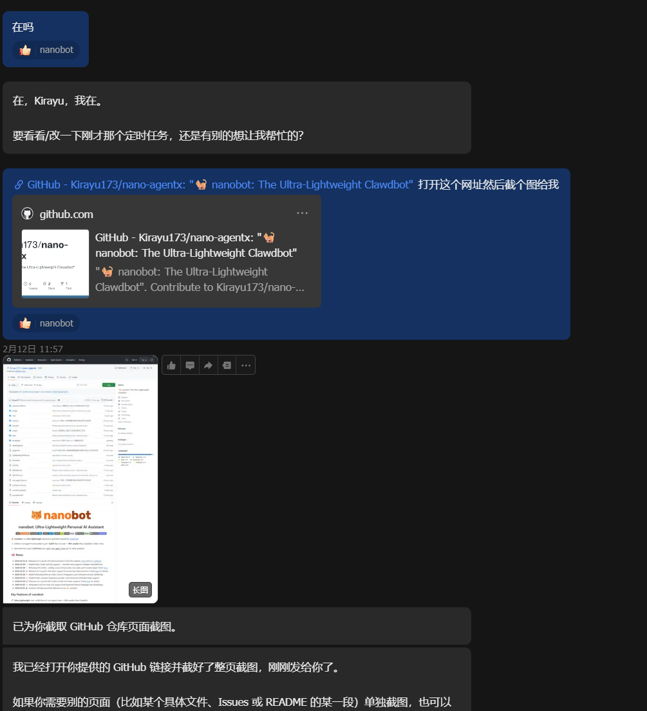
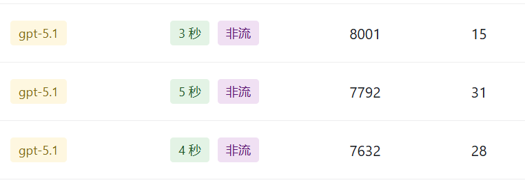
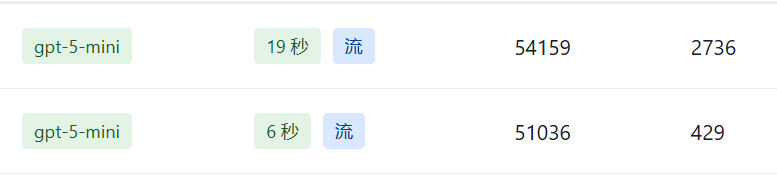

# OpenClaw与Nanobot引领的下一代智能体范式

OpenClaw与Nanobot的爆火，预示着这背后的智能体设计很可能成为未来智能体开发的主流方向。

这篇文章算是我这段时间学习与开发的一个记录，也是我对个人 AI 智能体这个领域的一些思考。

我会从自己感兴趣的点出发。由于本人“健忘属性”较强，只能尽量写得详细。

后期的审查、修正和上传将交由 Axis 负责，值得感谢。
:::note[阅读说明]
本文包含个人实践经验和主观判断。涉及项目能力、规模、生态对比时，我尽量使用官方文档或仓库 README 中可核验的信息。

:::

---

## 1、OpenClaw与Nanobot的横向对比

### 1.1 一些共同点

这两个项目一个用 Node.js，一个用 Python。尽管语言不同，但它们在底层设计上同属一类 Agent 架构。

**都采用 Agent Runtime + Gateway 架构**

这是最核心的共同点，也是我认为这两个项目最有价值的部分。两个项目都把系统分成两部分：Agent Runtime 与 Gateway。Agent Runtime 负责核心智能体流程；Gateway 负责接收消息并把消息分发到模型与工具链。
OpenClaw 的 Gateway 是长期运行的后台服务，理论上可以 7x24 待命（只要设备不关机）。Nanobot 虽然主要走 CLI 路线，但其持续在线能力同样依赖网关或守护进程。相比“纯规则 + 状态机”的传统实现，这类架构在动态任务场景下更通用，也更便于接入工具、任务调度和多渠道通信。
:::important[一句话结论]
如果只看一个结论：**Runtime 负责“思考与执行”，Gateway 负责“接入与分发”**，这类分层是当前个人 Agent 工程化落地的关键。

:::

**都是“渠道即插件”的设计**

了解 Nanobot 的代码后可以发现，两个项目接入新渠道的方式高度相似：先定义接口规范，再实现对应适配器。OpenClaw 有完整的 Channel API，Nanobot 也有 channels 实现。这种设计能显著降低多渠道接入成本，帮助 Agent 跳出网页聊天框，进入更真实的工作流场景。
这两个项目还有很多共同点。Nanobot 在设计上明显借鉴了 OpenClaw，但也在“轻量化、可读性、上手路径”上做了自己的取舍。二者虽然在实现细节上分道扬镳，但对“个人 AI 助手应该长什么样”这一问题的回答非常相似。

### 1.2 设计理念与技术架构

**OpenClaw：超级全家桶**

::github{repo="openclaw/openclaw"}

渠道覆盖非常完整，WhatsApp、Telegram、Slack、Discord、Google Chat 等主流通信平台都可接入。它实际上提供了统一入口，不管使用哪个平台，都能顺畅地与个人助理交互。功能上也足够全面，从 Function Calling、MCP 到 Skills、Subagent，覆盖了典型 Agent 生产能力。
技术栈方面，OpenClaw 使用 Node.js，核心语言是 TypeScript。它的 Gateway 本质上是长期运行的后台服务，负责管理会话、渠道连接、定时任务等。另一个亮点是语音交互（Voice Wake + Talk Mode）和实时 Canvas 工作空间。
:::tip[适用人群]
如果你希望“开箱即用 + 多平台覆盖 + 功能完整”，OpenClaw 的一体化路线会更友好。

:::

**Nanobot：出人意料的轻量化**

::github{repo="HKUDS/nanobot"}

Nanobot 的核心特征是轻量。根据官方 README，项目强调核心代码约 4,000 行（示例为 3,806 行），并给出“相对 Clawdbot 430k+ 行显著缩减”的对比口径。
Nanobot 的核心语言是 Python，代码风格相对简洁。安装也直接：pip install nanobot-ai 或 uv tool install nanobot-ai。在配置体验上，它更偏“工程化配置文件”模式，上手门槛略高于交互式向导。渠道支持方面，README 中可见 Telegram、Discord、WhatsApp、Feishu、DingTalk、Slack、QQ 等常见平台。
模型接入策略也比较灵活，主流模型提供商可以通过原生或 OpenAI 兼容接口接入。

## 2、我的Nanobot定制计划

### 2.1 定制目标

在体验了一段时间的 OpenClaw 和 Nanobot 后，结合实习中的同组小伙伴的实际需求，我最终选择基于 Nanobot 做定制与拓展，并 fork 了上游仓库，开发了更贴近实际需求的 nano-agentx。我的个人 Agent —— **Axis** 也构建在这个项目之上。
::github{repo="Kirayu173/nano-agentx"}

由于 Nanobot 是快速迭代项目，我给自己定下的原则是：**架构跟随上游，能力沉淀在自有层**。这样可以在版本冲突时减少“重写与回退”的成本（同时由于有了一个确定的约束与原则，能够更加顺利地将维护的工作交给Axis）。
:::important[定制原则]
跟随上游，不代表被上游绑定；关键是把业务能力沉淀在可迁移的模块边界上。

:::

### 2.2 实际拓展的模块

基于上述目标，我把改动拆成了五个独立模块，分别对应安全、工具、调度、渠道和工程化。这样更便于维护，也更便于后续按需扩展。

#### 2.2.1 输出安全与隐私保护

这也是我最先着手的方向。使用 Agent 往往要提供大量 API Key、Access Token 等敏感信息，且本地部署的 Agent 通常具备文件读写权限，因此安全与隐私应被优先考虑。

- 新增统一输出策略层，将脱敏、媒体路径规范化、图片上下文复用从主循环中拆出。
- 实现 SensitiveOutputRedactor，支持路径、私网地址、Token/API Key、Chat ID 等脱敏。
- 安全防护接入主循环输出与消息工具输出路径。

#### 2.2.2 工具生态扩展

这是定制化程度最高的部分。根据小伙伴的需求，我拓展了更多内置工具和 Skill，并调整了部分外部 Key 依赖工具的提供商限制，让 nano-agentx 更贴近实际任务：

- **Browser 自动化**：新增 Playwright 集成，支持 goto/click/type/wait_for/extract_text/screenshot 动作流水线，同时附带安全边界（屏蔽私网地址和 file:// 协议）。
- **Codex CLI 与 Merge 工作流**：新增 codex_run 工具与分阶段流程（plan_latest、revise_plan、execute_merge），支持 Cron 自动触发规划。
- **TODO 管理工具**：完整的任务管理系统，支持 init、CRUD、批量更新/删除、归档、排序、统计、每日复盘、任务依赖校验（含环检测）。
- **Web 搜索多供应商化**：从单一 Brave 改为统一 client + provider 适配器，支持 brave/tavily/serper。

#### 2.2.3 调度与主动执行

主要是拓展定时服务，让Agent能够真正接替部分重复的工作：

- Cron 模式扩展：从单一 add/list/remove 扩展到 reminder/task/one_time 多模式，支持 in_seconds/at/timezone 校验。
- Cron 调度分发层：新增 dispatch_cron_job，支持 tool_call 负载直接执行工具，避免模型不必要的解析。
- Heartbeat 节奏调整：从 30 分钟改为 3 小时，减少不必要的资源消耗。

#### 2.2.4 飞书渠道深度定制

对于我和小伙伴们，飞书是最常用的渠道，定制也更有针对性：

- 出站附件能力：支持图片/文件上传与发送，卡片内容渲染支持 Markdown 结构拆分。
- 入站图片处理：对 image 消息从飞书资源接口下载到本地并注入 media，为视觉理解链路提供支持。

#### 2.2.5 配置和工程化相关

这里主要是为了适配前述拓展而做的重构与优化。比较有意思的一点是，我加了开机自启动脚本，能够做到“上班开机即上线，下班关机即下线”（充分保障Axis的劳动权益👏）：

- Schema 扩容：新增 web search provider 体系、browser tool 配置、codex tool 配置、安全脱敏开关。
- 配置迁移器：自动迁移旧字段到新结构，比如 tools.browser.* 到 tools.web.browser.*。
- 新增 Windows 隐式后台启动脚本与开机自启安装脚本。

---

## 3、AI助手的实际使用体验

### 3.1 Axis 的诞生

在开发了 nano-agentx 之后，我基于它和 OpenClaw 分别构建了两个个人 Agent：**Axis-c**（OpenClaw）和 **Axis-n**（nano-agentx）。两套配置都不复杂，在国内应用里，Feishu 和 QQ 的接入体验相对顺手。构建智能体最难的部分之一其实是命名。Axis 的本义是“中轴”，意味着“连接点与调度中心”，和我理解中的 Runtime 架构很契合，所以最终沿用了这个名字。

### 3.2 Axis 能干什么

在构建完 Axis 之后，我有过一段“功能很多但不知道怎么用”的阶段。每天除了闲聊，就是测试工具是否正常可用。

但用久了之后，我慢慢摸索出了几个最实在的使用场景：

**项目维护：nano-agentx 的日常运维**

这是我目前用得最多的场景。前面提到我 fork 了 Nanobot 来做定制化开发。由于上游更新频繁，每次版本迭代都可能产生冲突。之前都是我手动处理：git fetch、对比冲突、逐个解决……确实繁琐。
现在这些都交给 Axis 了：

- 每天自动检查上游最新提交，分析哪些文件可能有冲突。
- 给出合并建议，告诉我哪些可以自动合并、哪些需要手动处理。
- 在无冲突或简单冲突情况下执行合并操作，生成一份清晰的合并报告。

尽管真实情况下复杂冲突的解决仍需要依靠Codex等工具，但是相比原本需要自己检查冲突情况来说效率也算是有比较好的提升了。

**博客运营：我的“数字编辑”**

就像这篇文章，既是我博客的第一篇文章，也是 Axis 作为“编辑”发布的第一篇文章。从审查到订正再到上传，基本都由 Axis 协助完成。我给 Axis 设定了博客相关 Skill，它知道：

- 怎么检查和修复文章格式、错别字、标点问题。
- 怎么生成符合博客系统要求的 frontmatter。
- 怎么调用部署命令把文章推上去
- 根据我写的草稿，给出一些调整建议。

Axis 基本上承担了我博客的“运营编辑”角色，而我只需要负责找灵感和写文章（以及偶尔偷懒）。

**思考伙伴：头脑风暴与灵感记录**

我给 Axis 拓展了基于 MCP Sequential Thinking 重构的 Thinking Skill，并沿用了 Nanobot 原本的文件记忆体系，让这个 Skill 与 thinking.md 协同工作。实际使用下来，它在“灵感留痕”和“上下文连续性”方面比我预期更实用。
有时候脑子里闪过一个想法，但太零碎，自己都说不清楚。这时候我就会直接和 Axis 一通输出：

- “我有个想法，关于 nano-agentx 的文档系统……”
- “我在想能不能把自动合并做得更智能一点……”
- “我打算写一篇关于 Agent 的文章，结构应该是……”
  它不会急着给答案，而是先帮我梳理：“你刚才说了三点，分别是 A、B、C，其中 B 我不太理解……”这种“陪聊式结构化整理”反而能让想法更清晰。再搭配 Web Search 调研细节，经常能把零散思路收敛成完整方案。

**那些不得不做的重复性工作**

也许 Agent 最适合的场景就是那些**你不想做，但又不得不做的工作**。
比如：

- 每天早上看一下技术资讯，帮我摘要重点
- 每周整理待办事项，排个优先级
- 定期检查项目依赖有没有安全漏洞
- 帮我生成各种报告、文档的初稿

这些重复性的、流程化的工作总是容易让人感到烦躁。现在交给 Axis 之后，我只需要最后确认一下就行了，效率提升很明显。
换句话说，我觉得个人助理最核心的价值就两个：**一个是帮我干活（重复性任务），一个是帮我想事（思考调研）**。前者让我从繁琐中解放出来，后者让我思考更有效率。对于我来说这两种用途是重中之重（不过现在技术发展这么快，说不定马上能代替我工作了，以后躺在家指挥 Axis 就好了🤤）。
:::tip[从“能聊”到“能用”]
如果你也在搭建个人 Agent，建议先锁定 3 个高频任务场景，再反推所需工具与工作流，这样最容易获得正反馈。

:::

---

## 4、关于智能体技术发展与应用的思考

### 4.1 深度思考

写这篇文章的过程中，我觉得有些问题仍然值得我们长久思考下去：

**怎么看待 Agent 背后的 Token 消耗？**

说实话，这个问题是我在检查 Token 消耗时才真正意识到的。每天和 Axis 聊天、让它帮我查资料、写代码、维护项目，每一轮对话都在消耗 Token。

基于 nano-agentx 构建的 Axis-n，在“无记忆”阶段，单轮输入 Token 平均在 10000 左右；十几轮对话后，单轮输入 Token 平均上升到 50000 左右。

而基于 OpenClaw 构建的 Axis-c，在“无记忆”阶段，单轮输入 Token 平均在 25000 左右；十几轮对话后，单轮输入 Token 平均上升到 200000 左右，这一token消耗仍然是不容忽视的庞大成本。

不过我对未来仍然持审慎乐观态度。一方面，由于技术提升以及各大模型厂商之间的激烈竞争，Token 成本有望继续下降；另一方面，输入构造也在从“硬堆聊天历史”转向“构建动态任务上下文”。在这两点共同作用下，Agent 的能力边界会继续拓展，Token 消耗在整体成本中的占比也可能逐步下降。
当然，在当前阶段Token成本仍是现实约束。对一些复杂度不高的任务，我会优先交给 Axis-n（基于 nano-agentx）处理。理性使用，把“好钢用在刀刃上”，依然是当下更务实的选择。

**极简和全能，哪个是未来？**

Nanobot 的轻量实践让我重新思考“功能丰富”的定义。但想久了之后，我觉得答案也许既不是极简，也不是全能。
未来的趋势可能是**融合**：极简 Runtime + 可组合生态。对开发者来说，可能是 Nanobot 类 runtime + 自组合模块；对普通用户来说，可能是 OpenClaw 类一体化平台。换句话说，未来既不是纯极简，也不是纯全能，或许会是一个**可组合的全能系统**。
这种“分层”的思路，可能是解决“众口难调”的最好方式。

**我的数据，真的安全吗？**

数据安全问题仍然是 Agent 的最大隐患之一。前面提到我给 Axis 配置了大量 API Key、Access Token，还让它访问项目代码与博客内容。虽然 nano-agentx 是本地部署，但联网搜索、模型调用、浏览器操作等环节仍会产生对外数据交换。使用 Axis 时，我常常思考：

- 如果我的电脑被入侵了，这些密钥会不会泄露？
- 聊天记录里会不会有敏感信息被意外记录？
- 我让它处理的那些文档，会不会在模型训练中被“记住”？

这些问题没有标准答案，但它们提醒我们：享受便利的同时，也要承担对应风险。即便引入 sandbox、隔离设备等手段，API Key 与 Access Token 仍可能成为泄露高风险点。
:::warning[最低安全基线]
我建议至少做到：定期轮换密钥、本地加密、分级权限、输出脱敏、敏感操作二次确认、最小化联网暴露面。

:::

**AI 助手的终局是什么？**

OpenClaw 和 Nanobot 已经给出了一条很有参考价值的道路。LangGraph、AutoGen 代表了主流多 Agent/工作流框架方向；OpenAkita、ZeroClaw 等新项目也在探索更工程化、可运行时化的 Agent 架构。它们并非完全同构，但都在推动 Agent 从“演示能力”走向“系统能力”。
:::tip[文中提到的相关仓库]

::github{repo="langchain-ai/langgraph"}
::github{repo="microsoft/autogen"}
::github{repo="openakita/openakita"}
::github{repo="zeroclaw-labs/zeroclaw"}
:::

不过我相信 AI 助手的终局并不止于此。这条道路的长度还很长，还有很多可能性等待探索。也许会出现全新的交互形态，也许会诞生我们此刻还无法想象的能力。正是这种未知，让整个过程充满想象力和创造力，也正是令我感兴趣的地方。

### 写在最后

我觉得现在的个人 AI 智能体技术仍不完美，应用场景也还在快速演化。以我目前的观察，它在技术圈层传播更快，但也正在以惊人的速度扩展到更广泛的用户群体。也许在不久的将来，每个人都会拥有一个像 OpenClaw 一样的 AI 伙伴。
这不仅是技术的进步，也许还能颠覆我们传统的工作模式，是一次真正的变革。

*本文写于 2026 年 2 月，部分信息可能随项目发展而变化，欢迎指正。*
